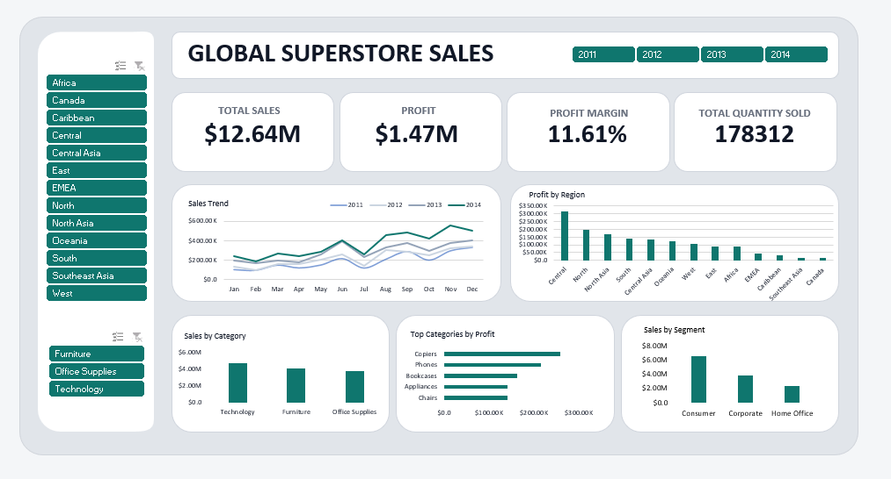

# Global Superstore Sales Analysis Dashboard

## Project Overview
This project analyzes the Global Superstore dataset to uncover sales performance, profitability patterns, and customer behavior across regions, categories, and segments.

The goal is to transform raw transactional data into clear, decision-ready insights using Excel dashboards and presentation slides.

## Objectives
- Analyze overall sales and profit performance
- Identify high-performing regions, categories, and segments
- Track sales trends over time
- Provide actionable business insights to support strategic decisions

## Tools Used
- Microsoft Excel
- Power Query (data cleaning & transformation)
- Pivot Tables & Pivot Charts
- Slicers for interactivity
- Microsoft PowerPoint
- Insight communication and storytelling

## Key KPIs
- Total Sales
- Total Profit
- Profit Margin
- Total Quantity Sold

## Analytical Questions Answered
- How do sales trend over time?
- Which regions generate the highest profit?
- Which product categories contribute most to sales?
- How does profit vary across regions?
- Which customer segments drive the most revenue?
- Which products contribute most to category-wise profit?

## Key Insights
- Sales show a consistent upward trend across the years analyzed.
- Certain regions significantly outperform others in profitability.
- Technology leads in revenue contribution compared to other categories.
- Consumer segment generates the highest sales among all segments.
- A small number of products contribute a large share of total profit.

## Recommendations
- Focus marketing and inventory efforts on high-profit regions.
- Invest more in top-performing product categories, especially Technology.
- Optimize pricing and cost strategies in low-profit regions.
- Leverage customer segmentation to tailor sales strategies.

## Project Files
- Excel Dashboard – Interactive sales and profit dashboard
- PowerPoint Slides – Summary of insights and findings
- Screenshots – Visual overview of the final dashboard

## Skills Demonstrated
- Data cleaning and transformation
- KPI development
- Dashboard design and storytelling
- Business insight generation
- Analytical thinking

## Preview

